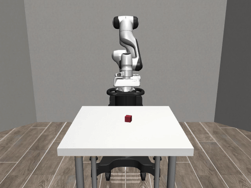
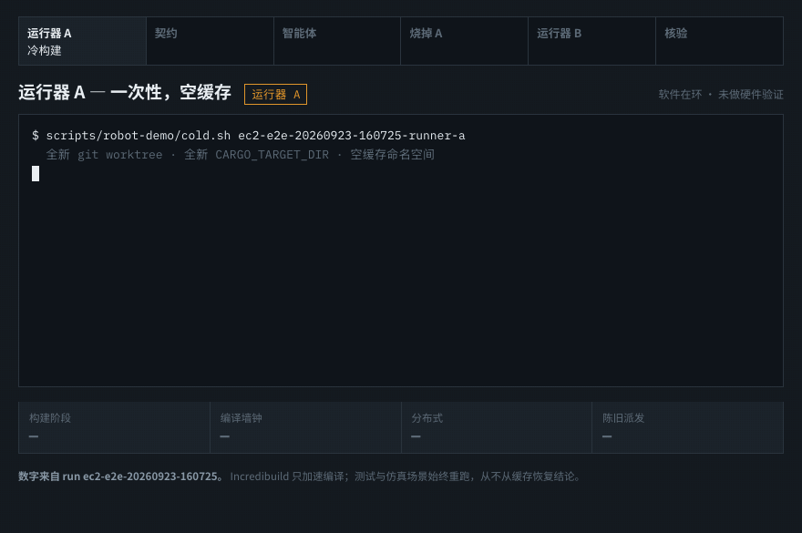

# rust-china-conf

**A Million Compiles. One Robot Hour.** — Disposable Runners, Warm Cargo Factory.

> Burn the runner. Keep the proof. Spare the robot.

[](https://zozo123.github.io/rust-china-conf/)

**[Open the website](https://zozo123.github.io/rust-china-conf/)** ·
**[Replay the evidence](https://zozo123.github.io/rust-china-conf/demo/?play=seeded)** ·
**[Read the 25-minute talk](docs/talk/talk-25min.md)**

Real robosuite / MuJoCo frames, recorded while the Rust gate authorized each
of the four motion segments. Not a separately animated robot.

## The loop



Cold distributed build on a disposable runner → three failing contract tests →
four dispatches permitted on a 600 ms-old observation → bounded agent patch →
**runner destroyed** → new runner rebuilds warm → 10/10 tests → zero stale
dispatches → 88/88 protected checks bound to the executable's digest.

Both build phases ran through Incredibuild (`ib: true` in the evidence). Cold
measured 21426 ms and warm 21948 ms, so **the warm phase was 522 ms slower.**
That demonstrates the accelerated path survived the runner being destroyed; it
is not a speedup measurement, and no speedup is claimed anywhere in this repo.
The controlled benchmark that would support such a claim is specified in
[`docs/talk/talk-25min.md`](docs/talk/talk-25min.md) and has not been run.

Regenerate either GIF from the pinned environment:

```bash
scripts/robot-demo/record-gif.sh        # real simulator footage
scripts/robot-demo/record-loop-gif.sh   # the loop walkthrough
```

An end-to-end **software-in-the-loop (SIL)** demonstration: a simulated Panda
arm lifts a cube (robosuite `Lift`). A deliberately seeded bug in a Rust
supervisor permits pickup actions from stale observations. A coding agent
repairs the bug. A fresh, isolated runner rebuilds the candidate and the
**actual resulting executable** rejects the stale case and completes the
fresh case in the simulator.

Full plan: [`docs/plan.md`](docs/plan.md) · Website:
[`docs/index.html`](docs/index.html) · Talk script:
[`docs/talk/talk-25min.md`](docs/talk/talk-25min.md) · Stage runbook:
[`docs/talk/runbook-6min.md`](docs/talk/runbook-6min.md)

## The story in one minute

1. `robot-safety-gate` is a pure Rust decision contract: simulated
   emergency stop first, invalid/future timestamps rejected, task actions
   permitted only when the observation is ≤ 250 ms old at dispatch.
2. **The seeded defect** (a labeled conference fixture): the freshness check
   is omitted. A 600 ms-delayed observation stream gets permitted pickups.
   Nothing crashes — a *protected assertion* catches it.
3. An agent gets a bounded work order and produces a 49-line patch
   (reviewed fallback: [`demo/fallback-patch.diff`](demo/fallback-patch.diff),
   branch `agent/fix-stale-observation`).
4. Runner A (isolated sandbox) is **destroyed**. Runner B — a new isolated
   sandbox — applies the patch to the exact base, rebuilds, and re-runs the
   protected checks.
5. The patched executable: stale episode → `rejected_stale`, **zero** task
   dispatches; fresh episode → `cube_lifted`. Protected verifier: 88/88.

## Quickstart

```bash
# 1. Rust toolchain (1.78+) and Python 3.10+ for the mock backend
cargo build --manifest-path rust/Cargo.toml --locked

# 2. Run the failing acceptance case on the seeded revision (mock backend)
./rust/target/debug/swf-cli robot-demo run --scenario stale_600ms --backend mock --run-id demo

# 3. Full arc: runner A (cold, failing) → patch → runner B (warm) → verdict
scripts/robot-demo/rehearse.sh my-rehearsal
```

### Real simulator backend (SIL)

```bash
uv venv --python 3.12 demo/robot-sim/.venv
uv pip install -p demo/robot-sim/.venv -r demo/robot-sim/requirements-linux.txt
ROBOT_DEMO_BACKEND=robosuite \
ROBOT_DEMO_PYTHON=$PWD/demo/robot-sim/.venv/bin/python3 \
  scripts/robot-demo/rehearse.sh sil-run
```

Verified on CPython 3.12 / robosuite 1.5.2 / MuJoCo 3.9.0. The pinned
requirements target Linux x86-64; the rehearsal also runs on macOS arm64.

## Seeded defect (conference fixture)

`main` intentionally carries the regression: `tests/contract.rs` fails on
the stale-observation cases **by design** — that failure is the demo. The
reviewed fix ships as `demo/fallback-patch.diff` and on branch
`agent/fix-stale-observation`. Do not "repair" main outside the scripted
agent workflow. The 250 ms threshold is an illustrative demo policy, **not**
an established safe threshold for physical robots.

## Architecture

```
agents → disposable runners → warm Cargo factory [IB] → retained evidence
       → simulation → future HIL / robot gate (not performed)
```

| Component | Owns |
|---|---|
| `rust/crates/robot-safety-gate` | Pure decision contract; controlled clock inputs; typed rejections |
| `rust/crates/swf-app` / `swf-cli` | Scenario identity, bridge subprocess protocol, decision logging, timeouts |
| `demo/robot-sim/bridge.py` | Sim state, proposal generation, authorization enforcement, stepping |
| `demo/robot-sim/scripted_controller.py` | Rehearsed approach/grasp/lift proposals (no learning) |
| `demo/robot-sim/acceptance/verify_run.py` | **Protected** verifier: trace assertions, artifact identity |
| `scripts/robot-demo/*.sh` | Runner A/B lifecycle: isolated git-worktree sandboxes, fresh outputs, export, teardown |
| `evidence/<run-id>/` | Manifest, events, results, build metrics, agent context, artifact digest |

Protocol invariants: one task action outstanding at a time; approvals valid
only for the exact action + tick; malformed/timed-out bridge → explicit
episode failure, never default authorization; rejections produce no
dispatch; hold steps are labeled and may still advance physics.

## Honest scope

- Performed: Rust contract checks, bridge checks, simulated robot scenarios.
- **Not** performed: hardware HIL, physical validation, trained vision
  (cube pose is simulator state; camera feed is for the audience).
- The `mock` backend is a kinematic stand-in for CI/dev, labeled in every
  message; mock results are not simulation results.
- Incredibuild accelerates **compilation only**; tests and scenario checks
  always re-execute. Where no IB wrapper is present, scripts say so and
  report a labeled native baseline instead of claiming acceleration.
- Runners are isolated local git worktrees with fresh `CARGO_TARGET_DIR`s.
  A remote sandbox provider (islo) can be configured via a gitignored
  `.env.local` (`ISLO_SANDBOX_KEY`) — never committed.

## Coverage matrix

5 reachable placements × 3 freshness scenarios (0 / 50 / 600 ms) + simulated
e-stop + protocol-timeout = 17 episodes, all validated by the protected
verifier against the actual built artifact. Example evidence from a real
robosuite rehearsal: [`docs/examples/`](docs/examples/README.md).
