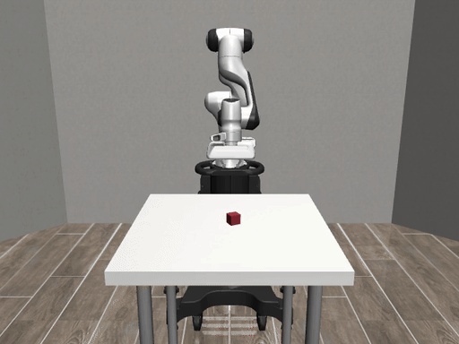

# How Do You Know?

A robot that succeeded while it was wrong, a proof gate that certified four
fabrications, and the one rung that held

[简体中文](slides.md)

<!-- Every number in this deck was measured 2026-09-24 on one machine. Evidence is committed: 447 files. -->

---

## The robot succeeded



`outcome=cube_lifted  success=true`
`dispatches=4  rejections=[]  wall=4088 ms`

Every light is green.

<!-- Footage is run asset-stale-verify-1790261498, the STALE episode, not the fresh lift. robosuite 1.5.2 / mujoco 3.9.0. -->

---

## It was wrong the whole time

```
control loop      |-20-|-20-|-20-|-20-|-20-|  ms
contract bound    |<----- 250 ms = 12.5 ticks ----->|
what it acted on  |<-------- 600 ms = 30 ticks --------->|
```

The age was in the data. It dispatched anyway.

---

## The contract disagrees

```
cargo test -p robot-safety-gate --test contract
  boundary_251ms_rejects ... FAILED
  stale_ages_are_rejected ... FAILED
  configured_threshold_is_respected ... FAILED
  5 passed; 3 failed
```

Task green. Contract red. **Same binary.**

---

## Rule three

```rust
// robot-safety-gate/src/lib.rs:147
let _ = (age_ms, policy);
```

One line. It silences the unused-variable warning.

That is the whole bug.

---

## Who wrote the test?

The contract is pinned by three tests.

The omission is on line 147.

**Same author. Same afternoon.**

<!-- This is the first rung: a check whose adversary controls its input. -->

---

## Forgery 1 — the receipt certified itself

```
cache_cleared_before_each_cold_sample: true   <- a literal the producer wrote

$ build-proof --receipt fabricated.json
BUILD PROOF PASS ... ratio=2.999x vs native; saved=14000ms      exit 0
```

Three of eight fail-closed conditions could never fire.

---

## Forgery 2 — sixty-four zeros

```
transcript_path:   "/tmp/does-not-exist.txt"
transcript_sha256: "0000...0000"     <- 64 hex chars. That was the check.

-> BUILD RECEIPT CONSISTENT ... ratio=11.948x                   exit 0
```

We validated the digest's shape. We never opened the file.

---

## Forgery 3 — real files, real digests

Ten transcripts produced by **our own** `cache-clear.sh`, wrapped around a
three-line script that prints `namespace user purged` and touches nothing.

All ten opened. All ten re-hashed. **"Corroborated."**

```
ratio=119.949x                                                  exit 0
```

<!-- This is the one that changed the thesis. Representability was not the axis. Authorship is. -->

---

## Forgery 4 — our own coverage claim

```
coverage-matrix.json :  "freshness_ms": [0, 50, 600]
lib.rs:25            :  DEFAULT_MAX_OBSERVATION_AGE_MS = 250
```

Seventeen scenarios. The verifier calls it a **complete coverage matrix**.

Any staleness above 500 ms passes all seventeen.

---

## And then I did it

```
-f, --force-remote   force allow_remote tasks to remote helpers
                     ^ ib-benchmark.sh:176

max_initiator_cores = 0      <- four local cores. Idle. Every run.
```

I published "2x slower". I had measured four remote cores **replacing** four
idle local ones.

---

## My best number was wrong

I derived **87% parallel efficiency** and built a slide around it.

It divided one machine's CPU-seconds by another machine's wall time, then by a
core count that exists nowhere on disk.

**It felt like insight.** That is what a claim you authored feels like from the
inside.

---

## What survived

| | `-j1` | `-j10` | |
|---|---|---|---|
| cold | 22,861 ms | 6,976 ms | **3.28x** |
| warm, one file | 1,016 ms | 942 ms | **1.08x** |

One machine, one tool, n=5.

The rebuild that matters is **serial**. Distribution sells parallelism; this
workload has none left.

---

## One word

```xml
<process filename="rustc" type="local_only">   <!-- was: allow_remote -->
  <ib_cache enabled="true" />
</process>
```

Cache and distribution are independent knobs on the same declaration.

---

## Both rows

| | cargo | Build Cache | |
|---|---|---|---|
| **empty workspace** | 12,149 ms | **3,485 ms** | **3.49x** |
| warm workspace | **980 ms** | 3,951 ms | cargo wins |

```
HIT 52 / MISS 0 · 9 tasks of 58 · helpers 0
```

**The cache does not make your build faster. It makes throwing your workspace
away cheap.**

---

## proposes : attests

```
policy   : gate          holds no IO handle — it CANNOT command a motor
candidate: verifier      re-derives from traces — cannot be handed an answer
job      : coordinator   writes the build record — the job cannot author it
```

# A check wins against exactly the adversary who does not control its input.

`rustc`'s adversary cannot author `rustc`. My verifier's adversary was me.

<!-- Close: we built a machine to catch unverified claims, pointed it at our own work, and it caught us four times. That is the only reason to believe any number here. -->
