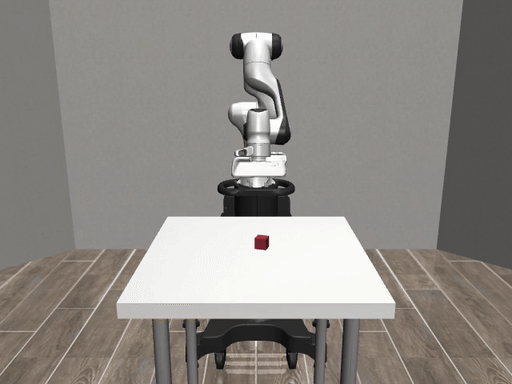

# A Million Compiles. One Robot Hour.

Disposable workspaces and independently checked robot behavior

[简体中文](slides.md)

<!-- Title expresses motivation, not a measured conversion. 25-minute talk with six-minute demo and five minutes of questions. -->

---

## The robot succeeded

| Check | Recorded seeded result |
| --- | --- |
| Cube lifted | Yes |
| Observation age | 600 ms |
| Freshness contract | Failed |

<!-- The image illustrates the simulator task from a separate fresh episode. Use the seeded replay for its decision data. Source: ../examples/ec2-runner-a/events-stale_600ms.jsonl -->

---

## The Rust contract

1. Simulated stop takes precedence
2. Future observation timestamps are invalid
3. At segment dispatch, observation age must be ≤ 250 ms

The seeded implementation omits rule 3.

<!-- Boundary tests cover 250/251 ms. This is a demo threshold; authorizations occur at segment boundaries, not every control step. -->

---

## Agent changes and acceptance criteria

| Agent may propose | Protected from candidate edits |
| --- | --- |
| Gate implementation patch | Contract tests |
| Explanation and test output | Simulator and scenario fixtures |
| | Verifier and runner scripts |

The default rehearsal uses a reviewed fallback patch.

<!-- The checked-in script does not invoke an LLM. If presenting an external agent, show that separate attempt and identify fallback use. -->

---

## Candidate validation stack

| Component | Responsibility |
| --- | --- |
| Temporary workspace | Candidate checkout and fresh outputs |
| Incredibuild | Compilation distribution/reuse integration |
| Rust + Python | Decision protocol and simulator execution |
| Protected verifier | Required cases, ordered traces, artifact identity |

<!-- The intended IB benefits need helper/cache telemetry. The observed build path alone does not prove reuse. -->

---

## Runner lifecycle

Workspace A exports the failure and base revision.

Workspace B applies the candidate and rebuilds with fresh outputs.

**EC2-backed workspaces today. Islo provider planned.**

<!-- A local Git worktree is not a VM security boundary. We remove workspaces, not EC2 machines. Tests rerun. -->

---

## Six-minute demonstration

Seeded failure · bounded patch · remove A

Fresh build in B · stale refusal · fresh lift

Evidence receipt for the actual executable

<!-- Switch to the runbook. Label replay and live runs separately. Full17-case rehearsal coverage must not be presented as two live selected cases. -->

---

## The patched behavior

| Observation | Task dispatches | Outcome |
| --- | --- | --- |
| Stale, 600 ms | 0 | Rejected at tick 12 |
| Fresh, 0 ms | 4 | Cube lifted |

Same patched executable in the recorded Linux run

<!-- Source: ../examples/ec2-runner-b/events-center-f600.jsonl and events-center-f0.jsonl -->

---

## Build observations

| Historical phase | Wall time |
| --- | --- |
| Runner A | 21.426 s |
| Runner B | 21.948 s |

B took **522 ms longer**. No measured speedup.

<!-- Both records indicate IB use. Different candidates, one sample per phase, uncontrolled cache states. No proof of helper work or cache reuse in those metrics. -->

---

## The evidence receipt

17 recorded simulator episodes:

**10 lifts · 5 stale rejections · 1 stop · 1 timeout**

Source, patch, executable identity and event traces

<!-- Run ec2-e2e-20260923-160725. Original verifier reported88/88; the strengthened current suite has different checks. Archived executable is not committed; new rehearsals export theirs. A digest is identity, not an execution attestation. -->

---

## Demonstrated scope

Software-in-the-loop with segment-level authorization

Simulator state supplies cube position

Physical hardware and performance benefits need separate validation

<!-- Also outside scope: trained vision, continuous control-step supervision, islo execution. Keep this concise and direct. -->

---

## Every candidate needs fresh checks

Temporary execution and reusable compilation have different lifetimes.

The robot’s behavior determines whether the repair satisfies its contract.

[Source, replay and evidence](https://github.com/zozo123/rust-china-conf)

<!-- Close, then questions. Controlled benchmark: same fixed candidate, native/IB empty/IB parent-warmed, ≥5 samples per mode, medians+ranges, disclosed contention. -->
